# BiseNetv2-Tensorflow
Use tensorflow to implement a real-time scene image segmentation
model based on paper "BiSeNet V2: Bilateral Network with Guided 
Aggregation for Real-time Semantic Segmentation". You may refer
https://arxiv.org/abs/2004.02147 for details.

The main network architecture is as follows:

`Network Architecture`


## Supporting the project
[CRNN_Tensorflow](https://github.com/MaybeShewill-CV/bisenetv2-tensorflow) is being 
sponsored by the following tool; please help to support us by taking a look 
and signing up to a free trial

<a href="https://tracking.gitads.io/?repo=bisenetv2-tensorflow"></a>

## Installation
This software has only been tested on ubuntu 16.04(x64), python3.5, 
cuda-9.0, cudnn-7.0 with a GTX-1070 GPU. To use this repo you 
need to install tensorflow-gpu 1.12.0 and other version of 
tensorflow has not been tested but I think it will be able to 
work properly if new version was installed in your local machine. Other required 
package can be installed by

```
pip3 install -r requirements.txt
```

## CityScapes Dataset preparation
The repo's model was mainly trained on cityscapes dataset. First
you need to prepare cityscapes dataset well. An example cityscapes
dataset file hierarchy can be found in ./data/example_dataset

The cityscapes dataset hierarchy:

`CityScapes Dataset Hierarchy`

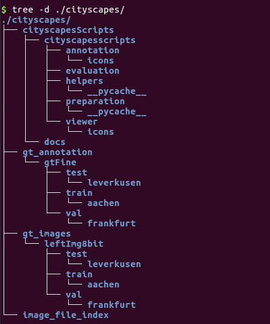

Once you have prepared the dataset's image well you may generate
the training image index file by
```
python ./data/example_dataset/cityscapes/image_file_index/make_image_file_index.py
```
If it was successfully executed you may see train.txt etc in folder
./data/example_dataset/cityscapes/image_file_index/. Each row of
the file contains a pair of training samples.


## Test model
In this repo I uploaded a model trained on cityscapes dataset 
[CityScapes](https://www.cityscapes-dataset.com/). The pretrained
model can be found at ./model/cityscapes/bisenetv2. The pretrained
model can reach a miou of 72.386 on cityscapes validation dataset.
This implementation can reach a 83fps on GTX 1070 accelerated by
tensorrt. The pretrained model can be downloaded 
[here](https://www.dropbox.com/sh/zqq6mye9yjko9tx/AACidyM0yyHY8XnTJYTxRnqMa?dl=0)

You can test a single image on the trained model as follows

```
python tools/cityscapes/test_bisenetv2_cityscapes.py --weights_path ./model/cityscapes/bisenetv2/cityscapes.ckpt 
--src_image_path ./data/test_image/test_01.png
```

The results are as follows:

`Test Input Image 1`

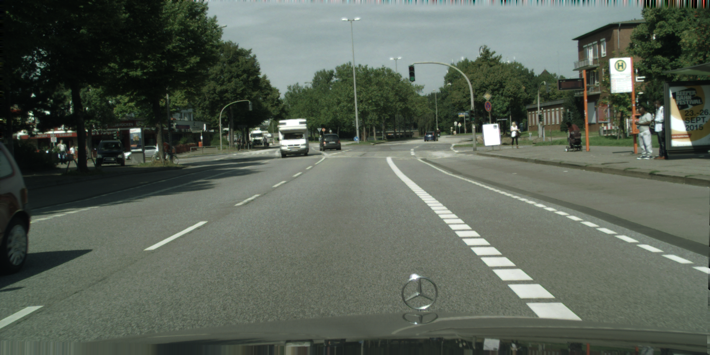

`Decoded Output Mask Image 1`

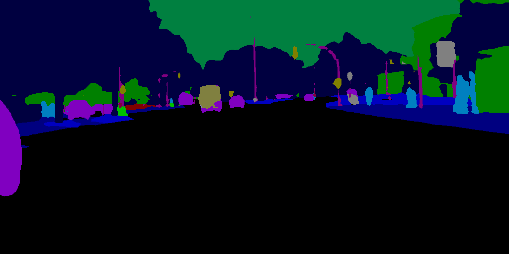

`Test Input Image 2`


`Decoded Output Mask Image 2`

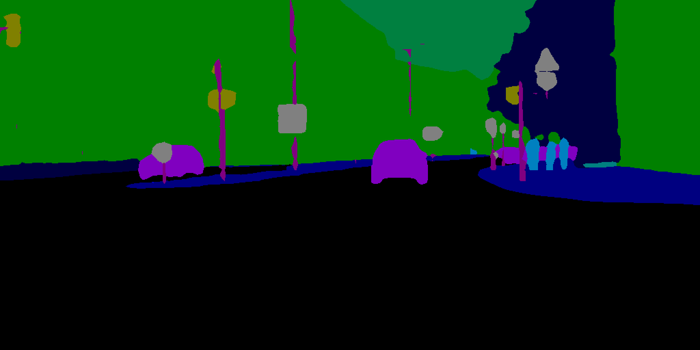

`Test Input Image 3`

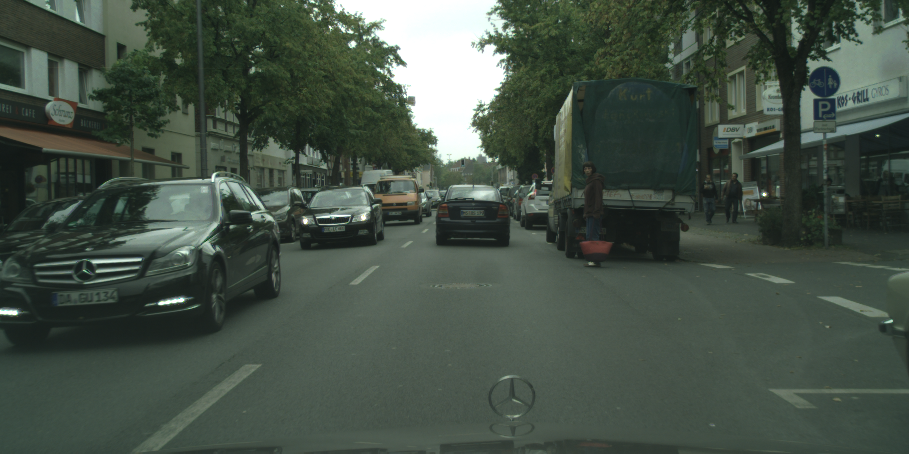

`Decoded Output Mask Image 3`

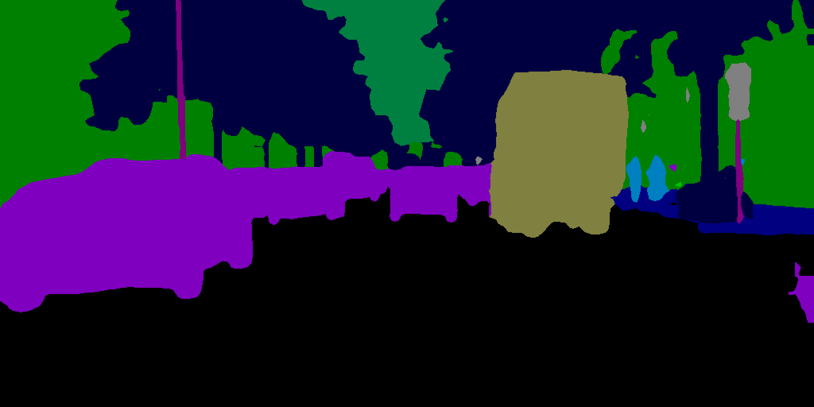


If you want to evaluate the model on the whole cityscapes 
validation dataset you may call
```
python tools/cityscapes/evaluate_bisenetv2_cityscapes.py 
--pb_file_path ./checkpoint/bisenetv2_cityscapes_frozen.pb
--dataset_dir ./data/example_dataset/cityscapes
```
You may get the final mious on the whole validation dataset

`Evaluation Result`


The validation procedure doesn't adopt any evaluation tricks
such as sliding-window evaluation and multi-scale testing 
which can improve accuracy but are time-consuming. With the 
input of 2048 × 1024 resolution, we first resize it to 
1024 × 512 resolution to inference and then resize the 
prediction to the original size of the input. You can do a
multiscale evaluation via adjust the min_scale and max_scale
in the evaluation script. 

The instruction can be reached by
```
python tools/cityscapes/evaluate_bisenetv2_cityscapes.py --help
```

## Train model from scratch
#### Data Preparation
For speed up the training procedure. Convert the origin training
images into tensorflow records was highly recommended here which
is also very memory consuming. If you don't have enough ROM you 
may adjust the data_provider in training scripts into 
./data_provider/cityscapes_reader and use feed dict to train 
the model which can be pretty slow. If you have enough ROM then
you may convert the training images into tensorflow records.

First modified the ./config/cityscapes_bisenetv2.yml with right
dataset dir path

`Config file dataset field`
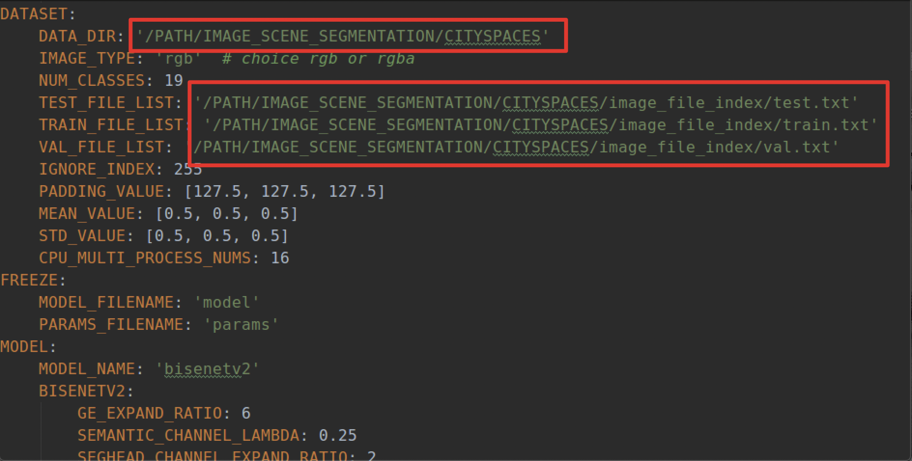

Then sse the script here to generate the tensorflow records file

```
python tools/cityscapes/make_cityscapes_tfrecords.py
```

#### Train model
You may start your training procedure simply by

```
CUDA_VISIBLE_DEVICES="0, 1, 2, 3" python tools/cityscapes/train_bisenetv2_cityscapes.py
```

By default multi gpu training mode was used here. You may read 
./config/cityscapes_bisenetv2.yml for details. If you do not have
multi gpu you may forbid multi gpu training mode in the config file
which may drop the model's performance since bn can not perform well
in small batch size.

The main model's hyperparameter are as follows:

**epoch nums**: 905

**learning rate**: 0.05

**lr decay strategy**: poly with power 0.9

**optimizer**: SGD

**batch size**: 16

**origin image size**: [2048, 1024]

**cropped image size**: [2048, 1024]

**step scaling range**: [0.75, 2.0]

**training example nums**: 2975

**testing example nums**: 1525

**validation example nums**: 500

Other hyperparameter can be found in the config file.

You may monitor the training process using tensorboard tools

During my experiment the `Total loss` dropped as follows:  
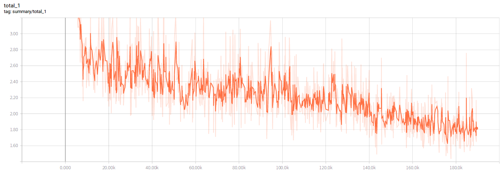

The `L2 loss` dropped as follow:
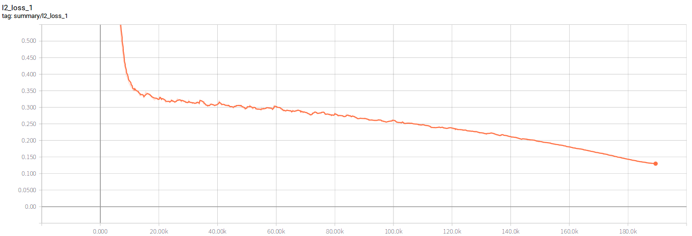

The `Learning rate` decayed as follows:
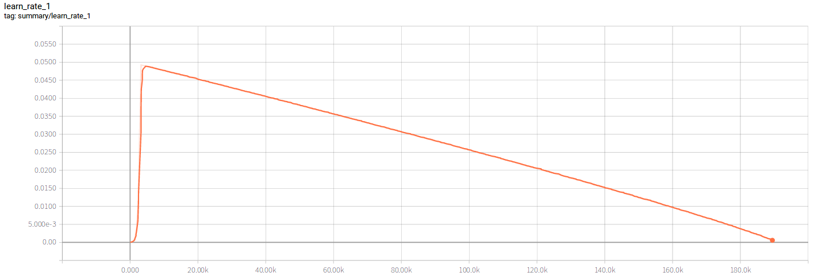

The `Miou` increased as follows:
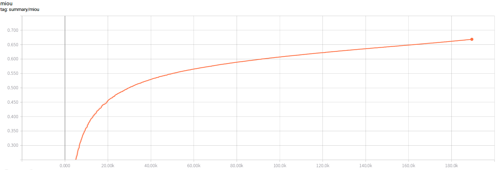 

## Time Profile Model
Here supply some tools to time profile the model's performance.
First make sure tf2onnx converter was successfully installed in
your local machine. You may follow the instruction 
[here](https://github.com/onnx/tensorflow-onnx) to install it.

I have uploaded a frozen tensorflow pb model in ./checkpoint folder.
You may run follows to freeze your own trainned models

```
python tools/cityscapes/freeze_cityscapes_bisenetv2_model.py 
--weights_path ./model/cityscapes/bisenetv2/cityscapes.ckpt
```

Once you have frozen pb model locally you may run following command
to convert the pb model into onnx model.

```
bash scripts/convert_tensorflow_model_into_onnx.sh ./checkpoint/bisenetv2_cityscapes_frozen.pb ./checkpoint/bisenetv2_cityscapes_frozen.onnx
```
A pre-converted onnx model was supplied also if you want your time be saved.
After all was done mentioned above you may simply run following
command to time profile the model's performance.

```
python tools/cityscapes/timeprofile_cityscapes_bisenetv2.py 
--input_image_path ./data/test_image/test_01.png
```

Basically the script do such few things:
1) Convert the onnx model into tensorrt engine
2) Run origin tensorflow frozen model for 500 times to calculate
a mean inference time comsuming and fps.
3) Run accelarated tensorrt engine for 500 times to calculate
a mean inference time comsuming and fps.
4) Calculate the model's gflops statics.

The following result should be generated if nothing goes wrong.

`TimeProfile Result`
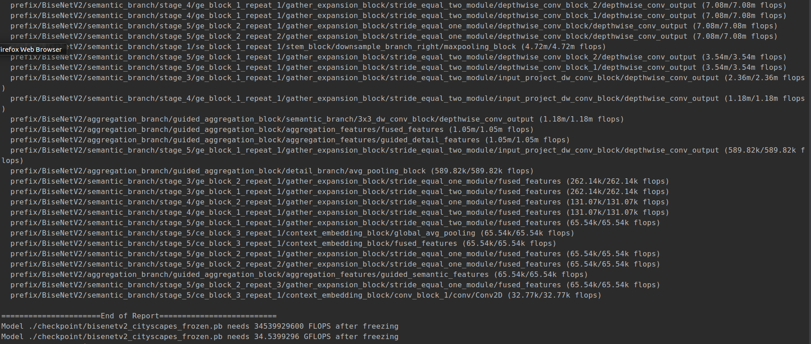

## Disscussion
1) The origin paper can reach a miou of 73.4 on cityscapes 
validation dataset which is outperformer than my implementation.
I suspect the reason may be I did not use the standard synchronized
bn in training procedure. Sereval experiments was doing recently. I will upload new model 
if I'm able to train a better one.
2) Sereval params mentioned in the paper was not very clear for me.
Here is a brief look at my confusion https://github.com/ycszen/BiSeNet/issues/2

If you have any ideas about such problem mentioned above or you
have futher update. You're welcomed to pull a request to make this
repo better.

## Experiments on other dataset

Release a pretrainde model on [CELEBAMASK_HQ](https://github.com/switchablenorms/CelebAMask-HQ)
dataset. The model can reach 107 fps with a input image of (512, 512) size.
The pretrained mode can be downloaded 
[here](https://www.dropbox.com/sh/0iisy23j4j6d1hj/AABm3fho2glNA7TWnvD7kK2oa?dl=0)

Testing model script comes as follows:

```
python tools/celebamask_hq/test_bisenetv2_celebamaskhq.py 
--weights_path PATH/TO/YOUR/CKPT/FILE 
--src_image_path ./data/test_image/celebamask_hq/test_01.jpg
```

`Celebamask_hq Test Source Input Image`


`Celebamask_hq Test Result Image`

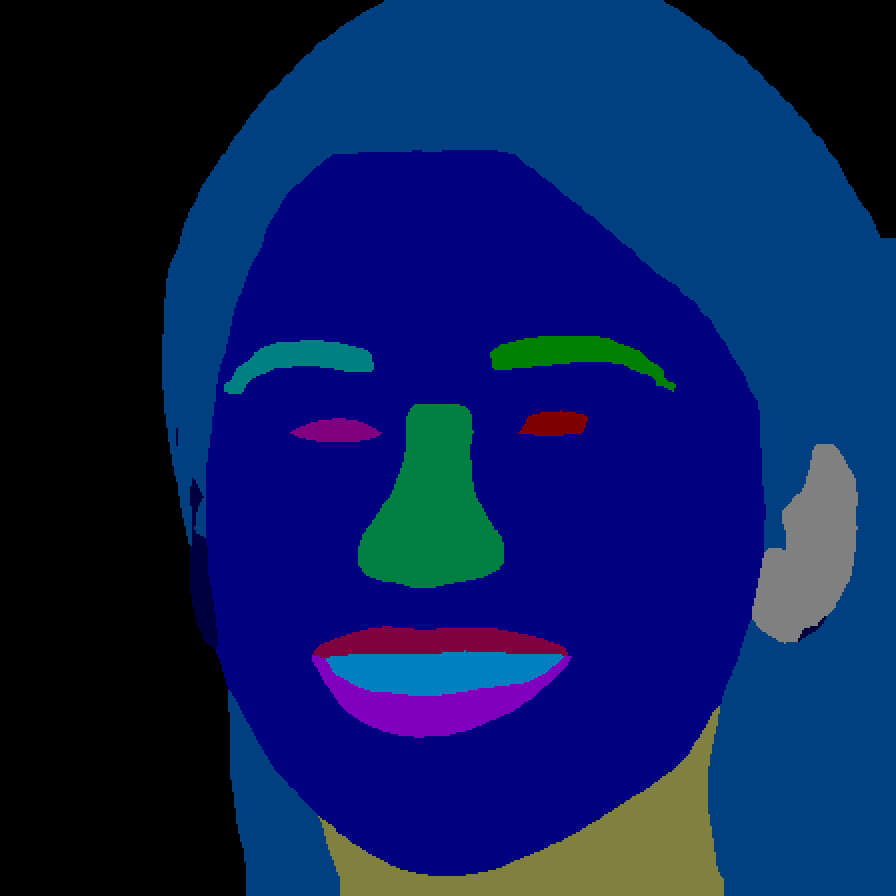


## TODO
- [x] Add OHEM module
- [ ] Search better hyperparameter for cityscapes dataset.
- [ ] Do experiments on other dataset such as CamVid etc.
- [x] Organize the code and release bisenetv1 training scripts and pretrained model.

## Acknowledgement

Finally thanks to the origin author [ycszen](https://github.com/ycszen).
BiseNet series are excellent work in my opinion. Really appreciate it.

Please cite my repo 
[bisenetv2-tensorflow](https://github.com/MaybeShewill-CV/bisenetv2-tensorflow) 
if you use it.

## Contact

Scan the following QR to disscuss :)

